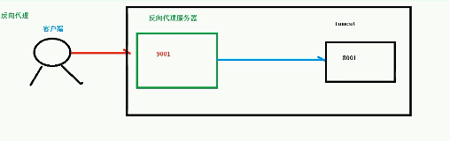
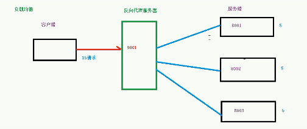
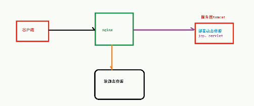
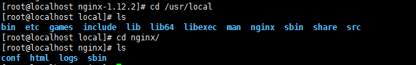
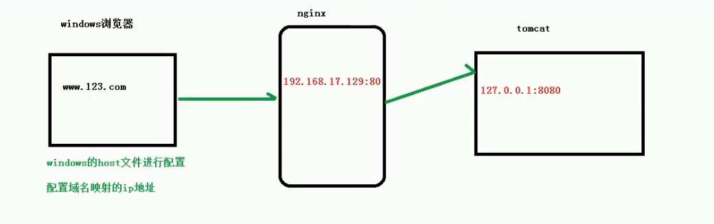
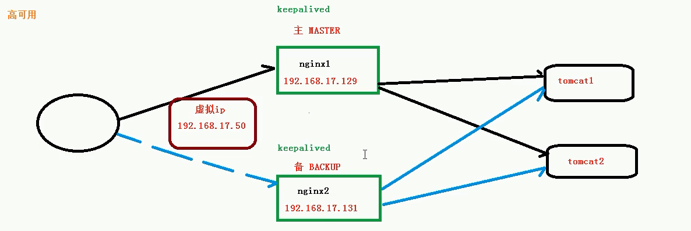

Nginx


1.Nginx是什么

*Nginx* (engine x) 是一个高性能的[HTTP](https://baike.baidu.com/item/HTTP)和[反向代理](https://baike.baidu.com/item/%E5%8F%8D%E5%90%91%E4%BB%A3%E7%90%86/7793488)web服务器，特点是占有内存少，[并发](https://baike.baidu.com/item/%E5%B9%B6%E5%8F%91/11024806)能力强，事实上nginx的并发能力在同类型的网页服务器中表现较好。

Nginx专为性能优化而开发，性能是其最重要的考量，实现上非常注重效率，能经受高负载的考验。能够支持高达 50,000 个并发连接数的响应。

### 正向代理&反向代理

####  	 正向代理

​		正向代理是一个位于客户端和原始服务器(origin server)之间的服务器，为了从原始服务器取得内容，客户端向代理发送一个请求并指定目标(原始服务器)，然后代理向原始服务器转交请求并将获得的内容返回给客户端。客户端才能使用正向代理。

​		Nginx不仅可以做反向代理，实现负载均衡 ，还能用作正向代理实现上网等的功能。

​               正向代理，如果把局域网外的internet想象成一个巨大的资源库，则局域网中的客户端要访问internet，则需要通过代理服务器来访问，这种代理服务称为正向代理。

​		

​	在客户端（浏览器）配置代理服务器，通过代理服务器进行互联网访问

​	

#### 	反向代理

​	  只需要将请求发送到反向代理服务器，由反向代理服务器去选择目标服务器获取数据后返回给客户端，此时反向代理服务器和目标服务器对外就是一个服务器。暴露的是代理服务器的地址，隐藏的是真实服务器地址。



#### 	正向代理和反向代理的区别

​		正向代理允许客户端通过它访问任意网站并且隐藏客户端自身，因此你必须采取安全措施以确保仅为经过授权的客户端提供服务。

​		正向代理是一种最终用户知道并主动使用的代理方式。

### 负载均衡

​	单个服务器解决不了大量的请求，通过增加服务器的数量，然后将请求分发到各服务器上。将原先请求集中到单个服务器上的情况改为将请求分发到多个服务器上，将负载分发到不同的服务器，也就是我们所说的负载均衡。

​	

### 动静分离

​	为了加快网站的解析速度，可以把动态页面和静态页面由不同的服务器来解析，加快解析速度，降低原来单个服务器的压力



linux中安装

​    (1)先安装nginx相关的依赖

​		a. 安装pcre

​			下载链接 : https://ftp.pcre.org/pub/pcre/pcre-8.37.tar.gz

​			解压安装: tar zxvf pcre-8.37.tar.gz

​			进入解压文件后的目录，执行 ./configure

​			执行 make & make install(编译和安装)

​			执行pcre-configure --version查看安装后的版本

​		b. 安装其他依赖

```bash
yum -y install gcc zlib zlib-devel pcre-devel openssl openssl-devel
```

(2) 安装nginx

​		下载   http://nginx.org/download/nginx-1.12.2.tar.gz

​		 解压安装 tar zxvf  nginx-1.12.2.tar.gz

​		进入解压文件后的目录，执行 ./configure

​		执行 make & make install(编译和安装)

安装成功后在 /usr/local/目录下 会生成nginx文件夹 



​	执行命令在 /usr/local/nginx/sbin 目录中

​	启动命令 

```bash
./nginx
```

​	查看是否启动，查看进程

```bash
ps -ef|grep nginx
```

由于在linux中是防火墙默认是不能访问到80端口的 需要配置防火墙允许可以访问的端口才能访问nginx

​	查看开放的端口号：

```bash
firewall-cmd --list-all
```

​	设置开放的端口号:

```bash
firewall-cmd --add-port=80/tcp --permanent
```

​	重启:

```bash
firewall-cmd --reload
```


​	    在浏览器中访问nginx部署所在的服务器ip地址 能出现页面表示可以访问


### Nginx常用命令


​	先进入目录

```bash
cd /usr/local/nginx/sbin
```

​     查看版本号：

```bash
./nginx -v
```

​	启动：

```bash
./nginx
```

​	关闭：

```bash
./nginx -s stop
```

​	重新加载：

```bash
./nginx -s reload
```


### Nginx配置文件

​	配置文件的位置:

/usr/local/nginx/conf/nginx.conf

​	Nginx配置文件组成

```xml

#user  nobody;
worker_processes  1;

#error_log  logs/error.log;
#error_log  logs/error.log  notice;
#error_log  logs/error.log  info;

#pid        logs/nginx.pid;


events {
    worker_connections  1024;
}


http {
    include       mime.types;
    default_type  application/octet-stream;

    #log_format  main  '$remote_addr - $remote_user [$time_local] "$request" '
    #                  '$status $body_bytes_sent "$http_referer" '
    #                  '"$http_user_agent" "$http_x_forwarded_for"';

    #access_log  logs/access.log  main;

    sendfile        on;
    #tcp_nopush     on;

    #keepalive_timeout  0;
    keepalive_timeout  65;

    #gzip  on;

    server {
        listen       80;
        server_name  localhost;

        #charset koi8-r;

        #access_log  logs/host.access.log  main;

        location / {
            root   html;
            index  index.html index.htm;
        }

        #error_page  404              /404.html;

        # redirect server error pages to the static page /50x.html
        #
        error_page   500 502 503 504  /50x.html;
        location = /50x.html {
            root   html;
        }

        # proxy the PHP scripts to Apache listening on 127.0.0.1:80
        #
        #location ~ \.php$ {
        #    proxy_pass   http://127.0.0.1;
        #}

        # pass the PHP scripts to FastCGI server listening on 127.0.0.1:9000
        #
        #location ~ \.php$ {
        #    root           html;
        #    fastcgi_pass   127.0.0.1:9000;
        #    fastcgi_index  index.php;
        #    fastcgi_param  SCRIPT_FILENAME  /scripts$fastcgi_script_name;
        #    include        fastcgi_params;
        #}

        # deny access to .htaccess files, if Apache's document root
        # concurs with nginx's one
        #
        #location ~ /\.ht {
        #    deny  all;
        #}
    }


    # another virtual host using mix of IP-, name-, and port-based configuration
    #
    #server {
    #    listen       8000;
    #    listen       somename:8080;
    #    server_name  somename  alias  another.alias;

    #    location / {
    #        root   html;
    #        index  index.html index.htm;
    #    }
    #}


    # HTTPS server
    #
    #server {
    #    listen       443 ssl;
    #    server_name  localhost;

    #    ssl_certificate      cert.pem;
    #    ssl_certificate_key  cert.key;

    #    ssl_session_cache    shared:SSL:1m;
    #    ssl_session_timeout  5m;

    #    ssl_ciphers  HIGH:!aNULL:!MD5;
    #    ssl_prefer_server_ciphers  on;

    #    location / {
    #        root   html;
    #        index  index.html index.htm;
    #    }
    #}

}

```

​	配置文件分三部分：

​		（1）全局块

​			 从配置文件开始到events模块之间的内容，主要会设置一些影响nginx服务器整体运行的配置命令。

​			比如 worker_processes  1, 值越大 表示可以支持处理的并发量也越多

​		  

​		（2）events 块

​			events块涉及的指令主要影响Nginx服务器与用户的网络连接。

​			比如: worker_connections  1024 表示最大网络连接数1024

​		 （3）http块	

​			 http块是Nginx中配置最频繁的部分，http块也可以包括http全局块、server块。

​			1) http全局块:

​			  http全局配置的指令包括文件引入、MIME-TYPE定义、日志自定义、连接超时时间、单连接请求数上限等。

```xml
include       mime.types;
    default_type  application/octet-stream;

    #log_format  main  '$remote_addr - $remote_user [$time_local] "$request" '
    #                  '$status $body_bytes_sent "$http_referer" '
    #                  '"$http_user_agent" "$http_x_forwarded_for"';

    #access_log  logs/access.log  main;

    sendfile        on;
    #tcp_nopush     on;

    #keepalive_timeout  0;
    keepalive_timeout  65;

    #gzip  on;
```

​			2)server块

​	这块和虚拟主机有密切关系，虚拟主机从用户的角度看，和一台独立的用户主机完全一样，该技术产生是为了节省互联网服务器硬件成本。

​      每个http块可以包含多个server块，而每个server块就相当于一个虚拟主机。

​	而每个server块也分为全局server块，以及可以同时包含多个location块。

​			**全局server块**				

​	最常见的配置是本虚拟主机的监听配置、虚拟主机名称和IP配置

​			**location块**		

​	一个server块可以配置多个location块。

这块的主要作用是基于Nginx服务器接收到的请求字符串(/serverName/urlStr),对虚拟主机名称（也可以是IP别名）之外的字符串进行匹配，对特定的请求进行处理。地址定向、数据缓存和应答控制等功能。还有许多第三方模块的配置也在这里进行。


### 	配置实例

#### 		反向代理实例一

​	(1) 实现效果

​		浏览器输入www.zxghsd.com 跳转到tomcat首页

​       (2) 具体实现

​		step1:  先安装tomcat和jdk

​		             启动： ./startup.sh

​			    查看启动日志: 在logs目录中，tail -f catalina.out

​		step2: 对外开放访问的端口

```bash
firewall-cmd --add-port=8080/tcp --permanent
firewall-cmd --reload
```

​			

​	(3) 访问过程分析	

(4) 具体配置

​	step1: 在windows的host文件中进行域名和ip的配置

​	C:\Windows\System32\drivers\etc\host 

​	添加内容:

```xml
192.168.224.130 www.zxghsd.com
```

​	step2: 在Nginx中配置请求转发配置

​	在nginx.conf配置文件中 ：

```xml
#修改 server_name  localhost
 server_name  192.168.224.130
#添加
 location / {
            root   html;
			#添加的转发地址
			proxy_pass http://127.0.0.1:8080;
            index  index.html index.htm;
     }
#重启
./nginx -s reload

```

#### 	反向代理实例二

​	(1) 实现效果

​		使用Nginx反向代理 根据访问路径跳转到不同端口的服务中:

​		Nginx监听的端口为9001

​		访问 http://127.0.0.1:9001/edu/  跳转到 127.0.0.1:8080

​		访问 http://127.0.0.1:9001/vod/  跳转到 127.0.0.1:8081

​	(2) 准备工作

​		a.准备两个tomcat服务器，一个8080端口，一个8081端口

​		b. 创建文件和测试的页面

​	(3) 具体配置

​		a.在nginx.conf配置文件中添加:

```xml
server {
        listen       9001;
        server_name  192.168.224.130;
        location ~/edu/ {
             proxy_pass http://127.0.0.1:8080;
        }
        location ~/vod/{
            proxy_pass http://127.0.0.1:8081;
        }
    }

```

​    	  b. 开放对外访问的端口 8080 8081 9001

​		

#### location指令说明

```xml
location [= | ~ | ~*|^~] uri{

}
```

  		1. = ：用于不含正则表达式的uri前，要求请求字符串与uri严格匹配，如果匹配成功，就停止继续向下搜索并立即处理该请求。
                		2. ~：用于表示uri包含正则表达式，并且区分大小写
            		3. ~*：用于表示uri包含正则表达式，不区分大小写
		4. ^~：用于不含正则表达式的uri前，要求Nginx服务器找到uri和请求字符串匹配度最高的location后，立即使用此location处理请求，而不再使用location块中的正则uri和请求字符串做匹配

注意：如果uri中包含正则表达式，则必须使用~或者~*标识


#### 负载均衡实例

(1) 实现效果

浏览器地址栏输入http://192.168.224.130/edu/a.html 负载均衡效果 平均8080和8081端口

(2)准备工作

​	a.准备两台tomcat服务器 一台8080 一台8081

​	b.在两台tomcat的webapps目录下，创建edu的文件夹 再文件夹中新建a.html文件 便于测试

(3)在Nginx.conf中配置

```xml
http{
	//添加开始
    upstream myServer(服务名称){
		server  192.168.224.130:8080;
		server  192.168.224.130:8081;
    }
	//添加结束
	
server{
	server_name 192.168.224.130;

    location /{
		//添加
		proxy_pass http://myServer;

    }
}
}
```

​          负载均衡是将负载分担到不同的服务单元，既保证服务的可用性，又保证响应足够快。Nginx提供了几种分配策略:

​	1 轮询(默认)

​	每个请求按时间顺序逐一分配到不同的后端服务器，如果服务器宕机，则自动剔除

​	2 weight(权重)

​           默认为1  权重越高 被分配的客户端越多

   ```xml
upstream myserver{
   server 192.168.224.130 weight=5;
   server 192.168.224.131 weight=10;
}
   ```

​       3 ip hash

​         每个请求按访问ip的hash结果分配，这样每个访客固定访问一个后端服务器，可以解决session的问题

```xml
upstream server_pool{
  ip hash;
  server 192.168.224.130;
  server 192.168.224.131;
}
```

​    4 fair(第三方)

按服务器的响应时间来分配，响应时间短的优先分配

```xml
upstream server_pool{
  fair;
  server 192.168.224.130;
  server 192.168.224.131;
}
```

#### 动静分离实例

​	Nginx动静分离简单来说就是把动态和静态的请求分开，不能理解成只是单纯的把动态页面和静态页面物理分离，严格意义上是将动态请求和静态请求分开。可以理解成使用Nginx处理静态页面，tomcat处理动态页面。动静分离从目前实现角度来看大致分两种。

一种是纯粹的把静态文件独立成单独的域名，放在独立的服务器上，也是目前的推荐的主流方案。

另一种是动态和静态文件混合在一起发布，通过Nginx分开

通过location指定不同的后缀名实现不同的请求转发，通过expires参数设置。可以使浏览器缓存过期时间，减少与服务器之前的请求和流量，具体Expires定义：是给一个资源设定一个过期时间，也就是说无需去服务端验证，直接通过浏览器自身确认是否过期即可，所以不会产生额外的流量。此种方法非常适合不经常变动的资源。（如果经常更新的文件，不建议使用Expries来缓存），我这里设置3d，表示在这3天内访问这个url，发送一个请求，比对服务器该文件最后更新时间没有变化，则不会从服务器抓取，返回状态码304，如果有修改，则直接从服务器重新下载，返回状态码200


  准备工作

(1)在linux系统中准备一些静态资源

在/data/www/目录中创建a.html      在/data/images/目录中创建a.png

具体配置

​	在nginx.conf中配置

```xml
location /www/{
     root /data/;
     index index.html index.htm;
}

location /images/{
     root /data/;
     autoindex on;
 }

```

#### 高可用集群实例



##### 准备工作

需要两台nginx服务器、两台服务器上均需要keepalived、虚拟ip

安装keepalived

yum install keepalived -y

查看安装版本

rpm -q -a keepalived

安装keepalived之后在etc中有 keepalived.conf

##### 高可用配置

(1)修改/etc/keepalived/keepalived.conf

```xml
! Configuration File for keepalived

global_defs { #全局配置
   notification_email { #指定keepalived在发生切换时需要发送email到的对象，一行一个
     acassen@firewall.loc
     failover@firewall.loc
     sysadmin@firewall.loc
   }
   notification_email_from Alexandre.Cassen@firewall.loc #指定发件人
   smtp_server 192.168.224.130  #指定smtp服务器地址
   smtp_connect_timeout 30 #指定smtp连接超时时间
   router_id LVS_DEVEL #此处注意router_id为负载均衡标识，在局域网内应该是唯一的。
  
}

vrrp_script chk_http_port{
	script "/usr/local/src/nginx_check.sh"
	interval 2  #检测脚本执行的间隔
	weight 2
}

vrrp_instance VI_1 { #虚拟路由的标识符
    state BACKUP  #状态只有MASTER和BACKUP两种，并且要大写，MASTER为工作状态，BACKUP是备用状态
    interface ens33  #通信所使用的网络端口
    virtual_router_id 51 #虚拟路由的ID号，是虚拟路由MAC的最后一位地址
    priority 90 #此节点的优先级，主节点的优先级需要比其他节点高
    advert_int 1 #通告的间隔时间
    authentication { #认证配置
        auth_type PASS #认证方式
        auth_pass 1111 #认证密码
    }
    virtual_ipaddress { #虚拟ip地址,可以有多个地址 每个地址占一行 不需要子网掩码，同时这个ip 必须与我们在lvs 客户端设定的vip 相一致！
        192.168.17.50
       
    }
}


```


(2)添加检测脚本

```sh
#! /bin/bash
A=`ps -C nginx -no-header |wc -l`
if[$A -eq 0];then
	/usr/local/nginx/sbin/nginx
	sleep 2
	if [`ps -C nginx --no-header |wc -l` -eq 0];then
		killall keepalived
	fi
fi	
```

（3）两台服务器上分别启动nginx和keepalived

systemctl start keepalived

(4)


