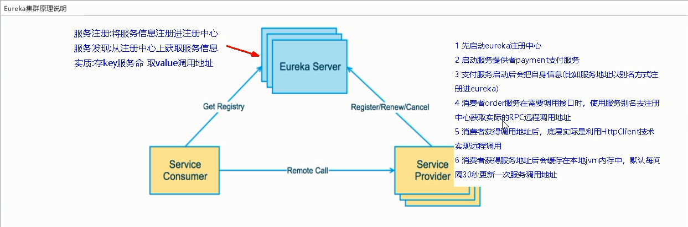
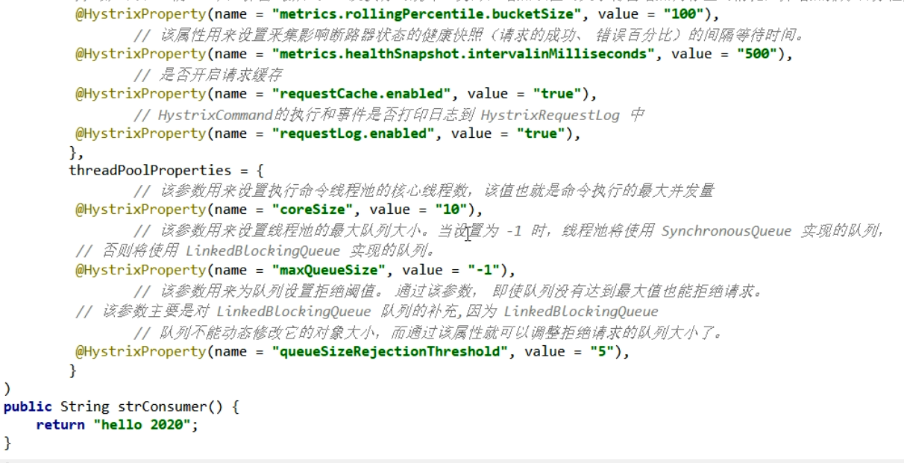

springCloud+springCloudAlibaba


SpringCloud== 分布式微服务的一站式解决方案，多种微服务架构落地技术集合体，俗称微服务全家桶。


京东微服务：


阿里：


主流微服务架构：


### 版本选择

springboot 2.x版       springcloud H版

cloud    Hoxton.SR1

boot 2.2.2.RELEASE

cloudalibaba  2.2.1.RELEASE

java 8

Maven 3.5及以上

Mysql 5.7以及以上

查看cloud版本和boot版本对应

https://start.spring.io/actuator/info

### cloud组件停更说明

eureka停更 nacos强烈推荐使用

   ribbon也停更了但还在使用


### Eureka

#### 	什么是服务治理

SpringCloud封装了netflix公司开发的Eurkea模块实现服务治理

在传统的rpc远程框架调用中，管理每个服务与服务之间的依赖关系比较复杂，管理比较复杂，所以需要服务治理，管理服务之间的依赖关系，可以实现服务调用、负载均衡、容错等，实现服务注册与发现。

Eureka采用了CS的设计架构，Eureka server作为服务注册功能的服务器，它是服务注册中心，而系统中的其他微服务，使用Eureka的客户端连接到Eureka Server并维持心跳连接。这样系统的维护人员就可以通过Eureka server来监控系统中各个微服务是否正常运行。

在服务注册与发现中，有一个注册中心，当服务器启动的时候，会把当前自己服务器的信息，比如服务地址 通讯地址等以别名的方式注册到注册中心上。另一方（消费者|服务提供者），以该别名的方式去注册中心获取到实际的服务通讯地址，然后再实现本地RPC调用远程RPC调用 核心设计思想：在于注册中心 因为使用注册中心管理每个服务于服务之间的一个依赖关系服务治理概念 


**EureKa的两个重要组件**

Eureka Server和Eureka Client


#### Eureka集群原理




集群使用步骤：


Eureka服务发现

对于注册进Eureka里面的微服务，可以通过服务发现来获取该服务的信息

可以从官方提供的DiscoveryClient类中获取服务信息

```java
 @Autowired
  private DiscoveryClient discoveryClient;

 List<String> clientServices=discoveryClient.getServices();

    for (String clientService : clientServices) {
            List<ServiceInstance> serviceInstanceList = discoveryClient.getInstances(clientService.toUpperCase());
            for (ServiceInstance serviceInstance : serviceInstanceList) {

                log.info("service名称:"+clientService+",host:"+serviceInstance.getHost()+",post:"+serviceInstance.getPort()+",uri:"+serviceInstance.getUri());
            }

        }
```

需要在启动类中加上注解@EnableDiscoveryClient

Eureka自我保护机制

某时刻某一个微服务不可用了，Eureka不会立即清理，依旧会对该微服务信息进行保存


#### 怎么禁止自我保护

在Eureka的服务端添加：

```yaml
eureka:
    server:
        #关闭自我保护机制 保证不可用服务被及时剔除
        enable-self-preservation: false
        #接收客户端发送心跳的间隔时间 eviction 驱逐
        eviction-interval-timer-in-ms: 2000
```

在Eureka的客户端添加:

```yaml
eureka:
  instance:
  	#心跳检测与续约时间 开发时可设置小些 方便及时剔除
    #eureka 客户端向服务器发送心跳的间隔时间 默认30秒
    lease-renewal-interval-in-seconds: 1
    #eureka 服务端在接收到最后一次心跳后等待时间上限，默认90秒 超时将剔除
    lease-expiration-duration-in-seconds: 2
```

zookeeper注册中心

zookeeper是临时节点

consul


三个注册中心异同点:


### Ribbon 负载均衡服务调用


是什么：


Ribbon目前已经进入维护模式，未来替换方案由springcloud提供的loadbandce

能做什么：

LB（负载均衡）


集中式LB:


进程式LB：


一句话概括：负载均衡+Resttemplate的调用

#### Ribbon负载均衡和Rest的调用

Ribbon负载均衡演示：

架构说明: Ribbon其实就是一个软负载均衡的客户端组件，他可以和其他所需的请求客户端结合使用，如和Eureka结合是其中的一个实例。

Ribbon 架构:


Ribbon的负载均衡实现:

IRule 根据特定算法从服务列表中选取一个要访问的服务，


默认负载均衡原理:


### OpenFeign

#### openFeign是什么


openFeign是一个声明是的web服务客户端，让编写web服务变得非常容易，只需创建一个接口，在接口上添加注解即可。


Feign和open Feign的区别:


openFeign使用步骤：

微服务调用接口+@FeignClient

主启动类上添加 @EnableFeginClient

业务类:

业务逻辑接口+@Feignclient配置provider服务

新建PaymentFeignService接口并新增注解@FeignClient


OpenFeign超时控制

默认openFeign客户端超时等待只有1秒钟


openFeign日志增强:


```yaml
#feign 日志以什么级别监控那个接口
logging:
  level:
    com.george.springcloud.service: debug
```

### Hystrix

#### 概述

分布式系统面临的问题

复杂分布式体系结构中的应用程序有数十个依赖关系，每个依赖关系在某些时候将不可避免失败。


#### Hystrix定义


#### Hystrix作用

服务降级、服务熔断、接近实时监控

#### Hystrix重要概念

##### 服务降级fallback

​	服务繁忙，请稍后再试 不要让客户端等待并立刻返回一个友好提示

​	哪些情况会出现？

​	程序运行异常、超时、服务熔断

##### 服务熔断 break

​	类比保险丝达到最大服务访问后，直接拒绝访问，拉闸限电，然后调用服务降级的方法并返回友好提示

##### 服务限流 flowlimit

​	秒杀高并发等操作，严禁一窝蜂的过来拥挤，大家排队，一秒钟N个，有序进行

##### Hystrix案例

###### 	构建

​	step1: 新建maven项目 cloud-provider-hystrix-payment8001

​	pom.xml配置如下：

```xml
<dependencies>

        <!--   hystrix     -->
        <dependency>
            <groupId>org.springframework.cloud</groupId>
            <artifactId>spring-cloud-starter-netflix-hystrix</artifactId>
        </dependency>

        <!--   引入eureka客户端     -->
        <dependency>
            <groupId>org.springframework.cloud</groupId>
            <artifactId>spring-cloud-starter-netflix-eureka-client</artifactId>
        </dependency>

        <dependency>
            <groupId>com.telecom.springcloud</groupId>
            <artifactId>cloud-api-commons</artifactId>
            <version>1.0-SNAPSHOT</version>
        </dependency>

        <dependency>
            <groupId>org.springframework.boot</groupId>
            <artifactId>spring-boot-starter-web</artifactId>
        </dependency>


        <dependency>
            <groupId>org.springframework.boot</groupId>
            <artifactId>spring-boot-starter-actuator</artifactId>
        </dependency>

		<!--
        <dependency>
            <groupId>org.mybatis.spring.boot</groupId>
            <artifactId>mybatis-spring-boot-starter</artifactId>
        </dependency>
        <dependency>
            <groupId>com.alibaba</groupId>
            <artifactId>druid-spring-boot-starter</artifactId>
            <version>1.1.10</version>
        </dependency>
        <dependency>
            <groupId>mysql</groupId>
            <artifactId>mysql-connector-java</artifactId>
        </dependency>
        <dependency>
            <groupId>org.springframework.boot</groupId>
            <artifactId>spring-boot-starter-jdbc</artifactId>
        </dependency> -->

        <dependency>
            <groupId>org.projectlombok</groupId>
            <artifactId>lombok</artifactId>
        </dependency>

        <dependency>
            <groupId>org.springframework.boot</groupId>
            <artifactId>spring-boot-devtools</artifactId>
            <optional>true</optional>
        </dependency>

    </dependencies>
```

​	step2:修改application.yml配置

```yaml
server:
  port: 8001
spring:
  application:
    name: cloud-provider-hystrix-payment
#eureka配置
eureka:
  client:
    #表示将自己注册到Eureak Server 默认为true
    register-with-eureka: true
    #是否从EureakServer中抓取已有的注册信息 默认为true 单节点无所谓 集群必须设置为true，才能配合ribbon使用负载均衡
    fetch-registry: true
    service-url:
      #单机版 Eureka
      defaultZone: http://eureka7001:7001/eureka
```

​	step3: 主启动类、controller层、service层

主启动类:

```java
package com.telecom.springcloud;

import org.springframework.boot.SpringApplication;
import org.springframework.boot.autoconfigure.SpringBootApplication;
import org.springframework.cloud.netflix.eureka.EnableEurekaClient;

/**
 * Date：2020-11-09 10:32
 * Description：
 */
@SpringBootApplication
@EnableEurekaClient
public class PaymentHystrixMain8001 {
    public static void main(String[] args) {
        SpringApplication.run(PaymentHystrixMain8001.class,args);
    }
}

```

service层:

```java
package com.telecom.springcloud.service;

import org.springframework.stereotype.Service;

import java.util.concurrent.TimeUnit;

/**
 * Date：2020-11-09 10:39
 * Description：
 */
@Service
public class PaymentService {

    /**
     * 服务正常
     * @param id
     * @return
     */
    public String paymentInfo_ok(Integer id){
        return "线程池： " + Thread.currentThread().getName() + " PaymenyInfo_OK,id: " + id + "\t" + "O(∩_∩)O哈哈~";
    }

    /**
     * 服务超时
     * @param id
     * @return
     */
    public String paymentInfo_timeout(Integer id){
        int timeNumber = 3000;
        try {
            TimeUnit.MILLISECONDS.sleep(timeNumber);
        } catch (InterruptedException e) {
            e.printStackTrace();
        }
        return "线程池： " + Thread.currentThread().getName() + " PaymenyInfo_TimeOut,id: " + id + "\t" + "O(∩_∩)O哈哈~" + " 耗时" + timeNumber + "毫秒";
    }
}

```

controller层：

```java
package com.telecom.springcloud.controller;

import com.telecom.springcloud.service.PaymentService;
import lombok.extern.slf4j.Slf4j;
import org.springframework.beans.factory.annotation.Autowired;
import org.springframework.web.bind.annotation.GetMapping;
import org.springframework.web.bind.annotation.PathVariable;
import org.springframework.web.bind.annotation.RestController;

/**
 * Date：2020-11-09 10:39
 * Description：
 */
@RestController
@Slf4j
public class PaymentController {

    @Autowired
    private PaymentService paymentService;

    @GetMapping("/payment/hystrix/ok/{id}")
    public String paymentInfo_ok(@PathVariable("id") Integer id){
        String result = paymentService.paymentInfo_ok(id);
        log.info("===========result===="+result);
        return result;
    }

    @GetMapping("/payment/hystrix/timeout/{id}")
    public String paymentInfo_timeout(@PathVariable("id") Integer id){
        String result = paymentService.paymentInfo_timeout(id);
        log.info("===========result===="+result);
        return result;
    }

}

```

step4:测试

启动eureka7001

启动cloud-provider-hystrix-payment8001

访问：http://localhost:8001/payment/hystrix/ok/1 （服务正常）

http://localhost:8001/payment/hystrix/timeout/1  (服务超时)

###### 高并发测试

测试步骤:使用jmeter模拟并发请求

用jmeter模拟20000个请求 去访问http://localhost:8001/payment/hystrix/timeout/1，此时在浏览器访问http://localhost:8001/payment/hystrix/ok/1 和http://localhost:8001/payment/hystrix/timeout/1

结果：http://localhost:8001/payment/hystrix/ok/1访问会变慢，当然http://localhost:8001/payment/hystrix/timeout/1会更慢

变慢原因：tomcat的默认工作线程数被打满了，没有多余的线程来分解压力和处理

###### 订单微服务调用支付微服务出现卡顿

新建订单微服务模块

pom.xml

```xml
 <dependencies>

        <!--  open feign      -->
        <dependency>
            <groupId>org.springframework.cloud</groupId>
            <artifactId>spring-cloud-starter-openfeign</artifactId>
        </dependency>

        <!--   hystrix     -->
        <dependency>
            <groupId>org.springframework.cloud</groupId>
            <artifactId>spring-cloud-starter-netflix-hystrix</artifactId>
        </dependency>

        <!--    引入自定义的api通用包，可以使用Payment支付Entity    -->
        <dependency>
            <groupId>com.telecom.springcloud</groupId>
            <artifactId>cloud-api-commons</artifactId>
            <version>1.0-SNAPSHOT</version>
        </dependency>
        <!--   引入eureka客户端     -->
        <dependency>
            <groupId>org.springframework.cloud</groupId>
            <artifactId>spring-cloud-starter-netflix-eureka-client</artifactId>
        </dependency>

        <dependency>
            <groupId>org.springframework.boot</groupId>
            <artifactId>spring-boot-starter-web</artifactId>
        </dependency>
        <dependency>
            <groupId>org.springframework.boot</groupId>
            <artifactId>spring-boot-starter-actuator</artifactId>
        </dependency>

        <dependency>
            <groupId>org.projectlombok</groupId>
            <artifactId>lombok</artifactId>
        </dependency>

        <dependency>
            <groupId>org.springframework.boot</groupId>
            <artifactId>spring-boot-devtools</artifactId>
            <optional>true</optional>
        </dependency>

    </dependencies>
```

yml配置文件:

```yaml
server:
  port: 80
spring:
  application:
    name: cloud-consumer-feign-hystrix-order
eureka:
  client:
     #是否将自己注册到注册中心, 默认true
    register-with-eureka: true
    #是否从EurekaServer抓取已有的注册信息,单机无所谓,集群必须设置为true配合ribbon使用负载均衡
    fetch-registry: true
    service-url:
      defaultZone: http://eureka7001:7001/eureka  #单机版
```

主启动类:

```java
import org.springframework.boot.SpringApplication;
import org.springframework.boot.autoconfigure.SpringBootApplication;
import org.springframework.cloud.netflix.eureka.EnableEurekaClient;
import org.springframework.cloud.openfeign.EnableFeignClients;

/**
 * Date：2020-11-09 15:51
 * Description：
 */
@SpringBootApplication
@EnableEurekaClient
@EnableFeignClients
public class FeignHystrixOrder80 {

    public static void main(String[] args) {
        SpringApplication.run(FeignHystrixOrder80.class,args);
    }

}
```

业务层:

```java
package com.telecom.springcloud.service;

import org.springframework.cloud.openfeign.FeignClient;
import org.springframework.stereotype.Service;
import org.springframework.web.bind.annotation.GetMapping;
import org.springframework.web.bind.annotation.PathVariable;

/**
 * Date：2020-11-09 15:53
 * Description：
 */
@FeignClient(value = "CLOUD-PROVIDER-HYSTRIX-PAYMENT")
@Service
public interface PaymentHystrixService {

    @GetMapping("/payment/hystrix/ok/{id}")
    public String paymentInfo_ok(@PathVariable("id") Integer id);

    @GetMapping("/payment/hystrix/timeout/{id}")
    public String paymentInfo_timeout(@PathVariable("id") Integer id);
}

```

controller层:

```java
package com.telecom.springcloud.controller;

import com.telecom.springcloud.service.PaymentHystrixService;
import lombok.extern.slf4j.Slf4j;
import org.springframework.beans.factory.annotation.Autowired;
import org.springframework.web.bind.annotation.GetMapping;
import org.springframework.web.bind.annotation.PathVariable;
import org.springframework.web.bind.annotation.RestController;

/**
 * Date：2020-11-09 15:58
 * Description：
 */
@RestController
@Slf4j
public class OrderHystrixController {

    @Autowired
    private PaymentHystrixService paymentHystrixService;

    @GetMapping("/consumer/payment/hystrix/ok/{id}")
    public String paymentInfo_ok(@PathVariable("id") Integer id){
        String result = paymentHystrixService.paymentInfo_ok(id);
        log.info("order-hystrix-80 paymentInfo_ok result:"+result);
        return result;
    }

    @GetMapping("/consumer/payment/hystrix/timeout/{id}")
    public String paymentInfo_timeout(@PathVariable("id") Integer id){
        String result = paymentHystrixService.paymentInfo_timeout(id);
        log.info("order-hystrix-80 paymentInfo_timeout  result:"+result);
        return result;
    }

}

```

20000个线程请求payment8001,消费者80侧再去访问http://localhost/consumer/payment/hystrix/ok/1  消费者侧会出现等待（转圈圈）或者直接报超时异常。

**故障现象和导致原因**:

8001的同一层次的其他接口微服务直接被困死，因为tomcat线程池里面的工作线程已经被挤占完毕。80此时调用8001，客户端响应缓慢。

**如何解决？**	

超时导致服务器变慢    -------超时不再等待

出错（程序宕机或出错）-------要兜底

解决思路：

对方服务（8001）超时了，调用者（80）不能一直卡死等待，必须有服务降级

对方服务（8001）down机了，调用者（80）不能一直卡死等待，必须有服务降级

对方服务（8001）OK，调用者（80）自己出故障或有自我要求（自己的等待时间小于服务提供者），自己处理降级

###### Hystrix服务降级之支付侧fallback

​	通过@HystrixCommand降低配置

​	设置自身调用超时时间的峰值，峰值内可以正常运行，超过了需要有兜底的方法处理，作服务降级fallback

​	实现：

业务侧 在方法上添加@HystrixCommand

```java
   /**
     * 服务超时
     * @param id
     * @return
     */
    @HystrixCommand(fallbackMethod = "paymentInfo_timeoutHandler",commandProperties = {
            @HystrixProperty(name = "execution.isolation.thread.timeoutInMilliseconds",value = "3000")//三秒钟以内就是正常逻辑
    })
    public String paymentInfo_timeout(Integer id){
        int timeNumber = 3000;
        try {
            TimeUnit.MILLISECONDS.sleep(timeNumber);
        } catch (InterruptedException e) {
            e.printStackTrace();
        }
        return "线程池： " + Thread.currentThread().getName() + " PaymenyInfo_TimeOut,id: " + id + "\t" + "O(∩_∩)O哈哈~" + " 耗时" + timeNumber + "毫秒";
    }

    public String paymentInfo_timeoutHandler(Integer id){
        return "线程池："+Thread.currentThread().getName()+"   系统繁忙, 请稍候再试  ,id：  "+id+"\t"+"哭了哇呜";
    }
```

主启动类上添加 @EnableCircuitBreaker

###### Hystrix服务降级之订单侧fallback

<span style="color:red">通常，服务降级都是在客户端侧进行的</span>

**controller添加@HystrixCommand**

```java
  @GetMapping("/consumer/payment/hystrix/timeout/{id}")
    @HystrixCommand(fallbackMethod = "paymentTimeOutFallbackMethod",commandProperties = {
            @HystrixProperty(name = "execution.isolation.thread.timeoutInMilliseconds",value = "3000")
    })
    public String paymentInfo_timeout(@PathVariable("id") Integer id){
        String result = paymentHystrixService.paymentInfo_timeout(id);
        log.info("order-hystrix-80 paymentInfo_timeout  result:"+result);
        return result;
    }

    //兜底方法
    public String paymentTimeOutFallbackMethod(@PathVariable("id") Integer id){
        return "我是消费者80，对付支付系统繁忙请10秒钟后再试或者自己运行出错请检查自己,(┬＿┬)";
    }
```

**主启动类添加 @EnableHystrix**

###### Hystrix全局服务降级

controller层要降级处理的类上添加注解@DefaultProperties

```java
@DefaultProperties(defaultFallback = "paymentGlobalFallbackMethod")
```

添加方法:

```java
public String paymentGlobalFallbackMethod(){
        return "全局报错异常,(┬＿┬)";
    }
```


controller层中的方法上仍然要加注解@HystrixCommand

###### Hystrix通配服务降级

创建实现类PaymentFallbackService去实现抽象接口PaymentHystrixService

PaymentHystrixService:

```java
@FeignClient(value = "CLOUD-PROVIDER-HYSTRIX-PAYMENT")
@Service
public interface PaymentHystrixService {

    @GetMapping("/payment/hystrix/ok/{id}")
    public String paymentInfo_ok(@PathVariable("id") Integer id);

    @GetMapping("/payment/hystrix/timeout/{id}")
    public String paymentInfo_timeout(@PathVariable("id") Integer id);


}
```

PaymentFallbackService:

```java
@Component
public class PaymentFallbackService implements PaymentHystrixService {
    @Override
    public String paymentInfo_ok(Integer id) {
        return "-------PaymentFallbackService fall back-[paymentInfo_OK],o(╥﹏╥)o";
    }

    @Override
    public String paymentInfo_timeout(Integer id) {
        return "-------PaymentFallbackService fall back-[paymentInfo_TimeOut],o(╥﹏╥)o";
    }
}
```

**在抽象类PaymentHystrixService上的@FeignClient注解中定义fallback指定的类**

```java
@FeignClient(value = "CLOUD-PROVIDER-HYSTRIX-PAYMENT",fallback = PaymentFallbackService.class)
```

注意在订单侧的controller层的方法中不需要添加注解@HystrixCommand

##### Hystrix服务熔断

###### **服务熔断机制概述**

熔断机制是应对雪崩效应的一种微服务链路保护机制。当扇出链路的某个微服务出错不可用或者响应时间太长时，会进行服务的降级，进而熔断该节点微服务的调用。快速返回错误的响应信息。**当检测到该节点微服务调用正常后，恢复调用链路。**

在SpringCloud中，熔断机制通过Hystrix实现。Hystrix会监控微服务调用的状况，当失败的调用到一定的阈值，缺省是5秒内调用20次失败，就会启动熔断机制。熔断机制的注解是@HystrixCommand

```java
  //服务熔断
    @HystrixCommand(fallbackMethod = "paymentCircuitBreaker_fallback",commandProperties = {
            @HystrixProperty(name = "circuitBreaker.enabled",value = "true"),  //是否开启断路器
            @HystrixProperty(name = "circuitBreaker.requestVolumeThreshold",value = "10"),   //请求次数
            @HystrixProperty(name = "circuitBreaker.sleepWindowInMilliseconds",value = "10000"),  //时间范围
            @HystrixProperty(name = "circuitBreaker.errorThresholdPercentage",value = "60"), //失败率达到多少后跳闸
    })
    public String paymentCircuitBreaker(@PathVariable("id") Integer id){
        if (id < 0){
            throw new RuntimeException("*****id 不能负数");
        }
        String serialNumber = IdUtil.simpleUUID();

        return Thread.currentThread().getName()+"\t"+"调用成功,流水号："+serialNumber;
    }
    public String paymentCircuitBreaker_fallback(@PathVariable("id") Integer id){
        return "id 不能负数，请稍候再试,(┬＿┬)/~~     id: " +id;
    }
```

###### **服务熔断原理总结**:

熔断类型：

 熔断打开：  请求不再进行调用当前服务，内部设置时钟一般为MTTR(平均故障处理时间)，当打开时长达到所设时钟则进入熔断状态

 熔断关闭:  熔断关闭不会对服务进行熔断

熔断半开:  部分请求根据规则调用当前服务，如果请求成功且符合规则则认为当前服务恢复正常，关闭熔断

断路器在什么情况下启用:


断路器开启或关闭的条件:

1. 当满足一定阀值的时候（默认10秒内超过20个请求次数）
2. 当失败率达到一定的时候（默认10秒内超过50%请求失败）
3. 到达以上阀值，断路器将会开启
4. 当开启的时候，所有请求都不会进行转发
5. 一段时间之后（默认是5秒），这个时候断路器是半开状态，会让其中一个请求进行转发。如果成功，断路器会关闭，若失败，继续开启。重复4和5

断路器开启之后:


断路器的所有配置:



###### Hystrix服务熔断工作流程


###### Hystrix服务监控hystrixDashBoard

修改修改cloud-provider-hystrix-payment8001 ,新版本Hystrix需要在主启动类MainAppHystrix8001中指定监控路径

```java
 @Bean
    public ServletRegistrationBean getServlet(){
        HystrixMetricsStreamServlet streamServlet = new HystrixMetricsStreamServlet();
        ServletRegistrationBean registrationBean = new ServletRegistrationBean(streamServlet);
        registrationBean.setLoadOnStartup(1);
        registrationBean.addUrlMappings("/hystrix.stream");
        registrationBean.setName("HystrixMetricsStreamServlet");
        return registrationBean;
    }
```

监控测试：

启动1个Eureka或3个Eureka即可

填写监控地址 9001监控8001 http://localhost:8001/hystrix.stream


### Gateway

